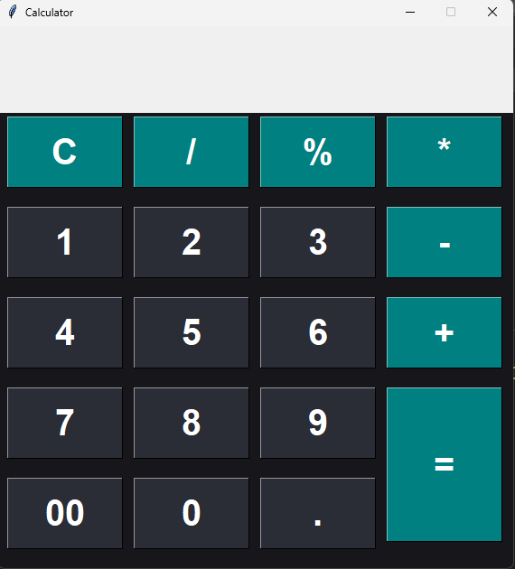

# Git-Calculator
Here I am going to push the code of Calculator using python
# Python GUI Calculator

This Python GUI (Graphical User Interface) Calculator provides a user-friendly interface for performing basic arithmetic operations using Python. With this application, users can easily perform addition, subtraction, multiplication, and division operations with just a few clicks.

## Features

- **Simple Interface**: The calculator offers a clean and intuitive interface, making it easy for users to input numbers and perform calculations.
- **Arithmetic Operations**: Users can perform addition, subtraction, multiplication, and division operations.
- **Error Handling**: The calculator includes error handling to prevent invalid inputs and division by zero errors.
- **History Functionality**: The calculator keeps track of the history of calculations, allowing users to review their previous calculations.
- **Memory Functions**: Users can store and recall numbers using memory functions such as memory clear, memory recall, and memory store.

## Installation

To run the Python GUI Calculator, follow these steps:

1. Clone the repository to your local machine:

    ```
        git clone https://github.com/SangeetaSharma73/Git-Calculator.git
    ```
2. Navigate to the project directory:
    ```
        cd Git-Calculator
    ```
3. Install the required dependencies:
    ```
        pip install -r requirements.txt
    ```
4. Run the application:
    ```
        python calculator.py
    ```

Usage

Launch the application by running calculator.py.
Use the buttons to input numbers and perform arithmetic operations.
Click on the "=" button to get the result of the calculation.
Use the "C" button to clear the input and start a new calculation.
Use memory functions (if available) to store and recall numbers for use in calculations.



Contributing
Contributions are welcome! If you would like to contribute to the Python GUI Calculator, please follow these guidelines:

Fork the repository.
Create a new branch for your feature or bug fix.
Make your changes and ensure the code passes any existing tests.
Test the application thoroughly.
Submit a pull request with a clear description of your changes.

Contact
If you have any questions, suggestions, or issues regarding the Python GUI Calculator, feel free to contact us at sangeeta136428sharma@gmail.com. We appreciate your feedback!

   